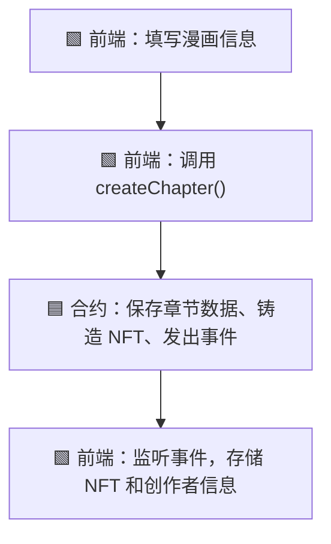
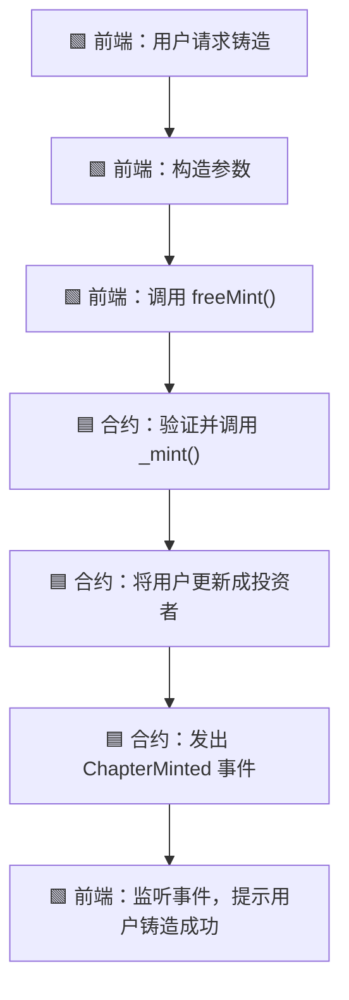
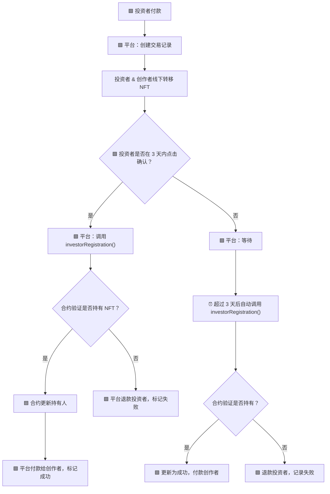
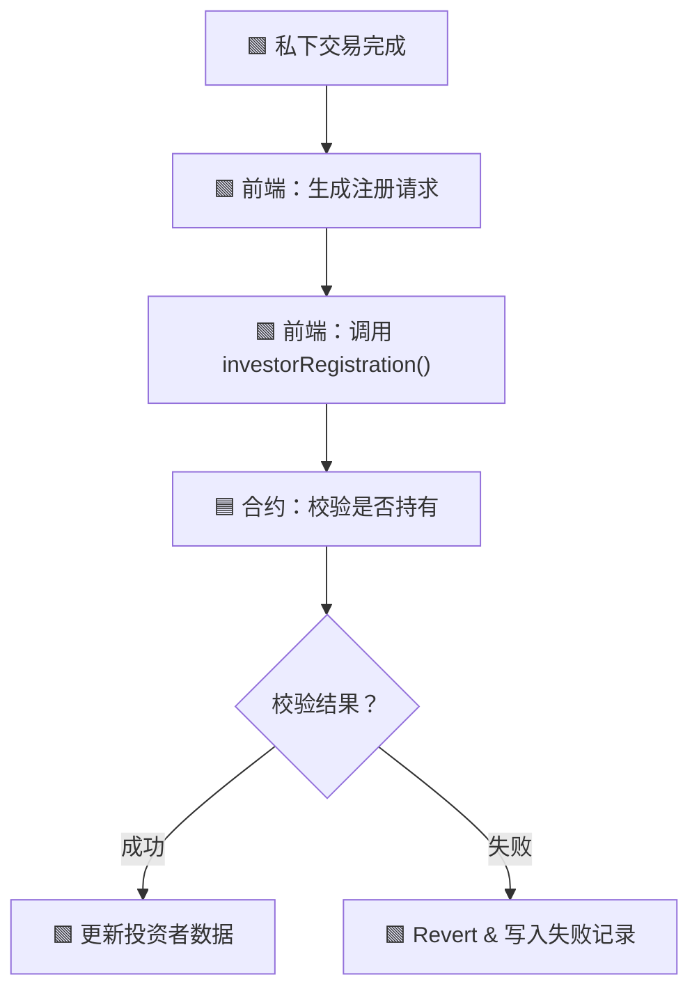

# 📘 MangaNFT 合约用户指南

## 🔹 概览

- **合约名称**: `MangaNFT`

- **标准**: ERC-1155，支持多语言、角色管理、章节创建、批量/单独铸造等

- **Solidity 版本**: `^0.8.24`

- **部署地址**: _部署后请替换此处_

---

## 🔹 系统流程总览

### 🧑‍🎨 1. 创作者发布章节（调用 `createChapter`）



---

### 🧾 2. 平台调用 `freeMint` 单独铸造流程



---

### 💰 3. 投资者平台交易确认与超时处理



---

### 🔄 4. 私下交易后的注册为投资者



---

## 🔧 主要函数说明（简明）

| 函数名                   | 用途          | 参数类型/格式                                         |
| ------------------------ | ------------- | ----------------------------------------------------- |
| `createChapter(...)`     | 创建 NFT 章节 | 标题/描述/数量/URI（详见上文）                        |
| `freeMint()`             | 单个铸造 NFT  | `(address to, uint256 tokenId, uint256 amountMinted)` |
| `investorRegistration()` | 注册投资者    | `(address investor, uint256 tokenId)`                 |

### 🧑‍🎨 `createChapter(...)`

**功能**：创作者创建漫画章节，铸造 80% 的份额给创作者，平台默认保留 1 份。

**函数签名**

```solidity

function createChapter(
	string memory mangaTitleZh,
	string memory mangaTitleEn,
	string memory mangaTitleJp,
	string memory descriptionZh,
	string memory descriptionEn,
	string memory descriptionJp,
	uint256 maxCopies,
	string memory uri_
) external returns (uint256);

```

**参数说明**

|参数名|类型|含义|
|---|---|---|
|mangaTitleZh|string|中文标题|
|mangaTitleEn|string|英文标题|
|mangaTitleJp|string|日文标题|
|descriptionZh|string|中文描述|
|descriptionEn|string|英文描述|
|descriptionJp|string|日文描述|
|maxCopies|uint256|NFT 最大数量（必须为 10 的倍数）|
|uri\_|string|章节元数据的 IPFS 链接|


**调用权限**：任何用户（通常为创作者）

**前端数据存储与更新建议**

- **NFT 相关**:

- `tokenId`： NFT 的链上 ID，用于后续追踪。

- `mangaTitleZh`：中文标题

- `mangaTitleEn`：英文标题

- `mangaTitleJp`：日文标题

- `descriptionZh`：中文描述

- `descriptionEn`：英文描述

- `descriptionJp`：日文描述

- `maxCopies`：此次发布的数量

- `mintTime`: 发布时间

- `supplyBalance`: NFT 可铸造的数量，运算逻辑为`supplyBalance=maxCopies-1-maxCopies*4/5`

- **创建者相关**:

- `tokenId`: NFT 的链上 ID

- `maxCopies`：此次发布的数量

- `onhandBalance`: 已持有数量，运算逻辑为`onhandBalance=maxCopies*4/5`

说明： 虽然上述信息均可上链存储，但是为了节约 gas 费用，所以建议前端同步存储数据。

**事件**

- `ChapterCreated(...)`

```solidity

event ChapterCreated(
	uint256 indexed tokenId,
	address indexed creator,
	string mangaTitleZh,
	string mangaTitleEn,
	string mangaTitleJp
);

```

- `ChapterMinted(...)`

```solidity

event ChapterMinted(
	uint256 indexed tokenId,
	address indexed to,
	uint256 amountMinted,
	uint256 mintTime
);

```

**前端注意事项**

- 要监听 `ChapterCreated` 和 `ChapterMinted` 事件获取 tokenId 和 mint 结果。

- 建议限制 `maxCopies` 为 10, 20, 30... 等合法值。

- IPFS CID 应符合 URI 格式，如 `ipfs://...`

---

### 🔄 `freeMint(...)`

**功能**：平台单独铸造 NFT，指定数量及接收者角色。

**函数签名**

```solidity

function freeMint(
	address to,
	uint256 tokenId,
	uint256 amountMinted
) public onlyPlatform;

```

**参数说明**

|参数名|类型|含义|
|---|---|---|
|to|address|接收者地址|
|tokenId|uint256|要铸造的 NFT ID|
|amountMinted|uint256|铸造份额数量|

**调用权限**：仅平台

**事件**

- `ChapterMinted(...)`

**前端注意事项**

- 自动添加投资人记录

---

### 💼 `investorRegistration(...)`

**功能**：平台在投资者已收到 NFT 后登记其身份为投资人

**函数签名**

```solidity

function investorRegistration(address investor, uint256 tokenId) public onlyPlatform;

```

**参数说明**

|参数名|类型|含义|
|---|---|---|
|investor|address|投资者地址|
|tokenId|uint256|NFT ID（投资者持有的）|

**调用权限**：仅平台

**效果**

- 校验该投资者是否真的持有该 NFT

- 更新投资者身份信息

**前端注意事项**

- 在私下交易或超时自动确认时由平台调用

- 若 `balanceOf` 不满足条件，将 revert：`Investor does not hold this NFT`

---

---

## ⚠️ 注意事项


- 所有 `struct[]` 需按 ABI 正确编码

- 所有 mint 函数都受 `onlyPlatform` 限制

- 合约已包含多语言支持与角色注册逻辑

- 推荐事件监听而非主动查询以节省链上读开销
