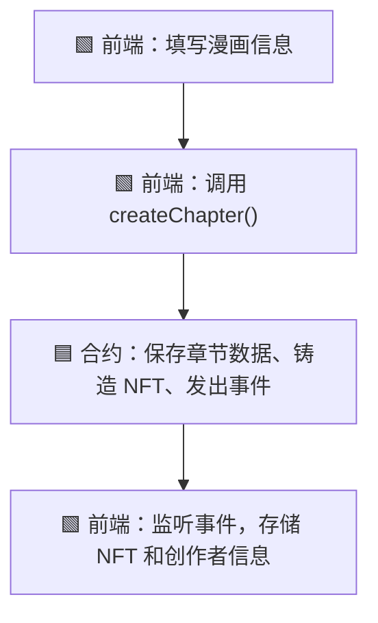
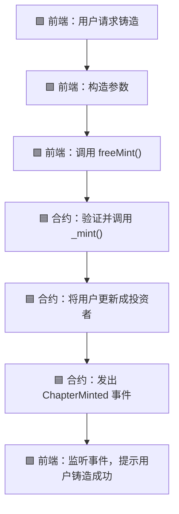
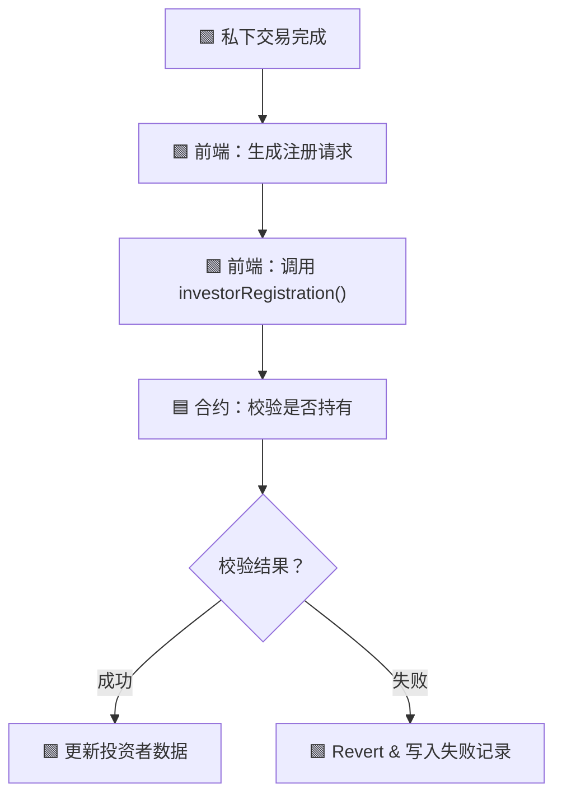

# 📘 MangaNFT 合约用户指南

## 🔹 概览

- **合约名称**: `MangaNFT`
    
- **标准**: ERC-1155，支持多语言、角色管理、章节创建、批量/单独铸造等
    
- **Solidity 版本**: `^0.8.24`
    
- **部署地址**: _部署后请替换此处_
    

---

## 🔹 系统流程总览

### 🧑‍🎨 1. 创作者发布章节（调用 `createChapter`）



---

### 🧾 2. 平台调用 `freeMint` 单独铸造流程



---

### 💰 3. 投资者平台交易确认与超时处理


---

### 🔄 5. 私下交易后的注册为投资者



---

## 🧩 数据结构说明


### `MintRequest` 结构体（用于 `batchSafeFreeMint`）

```solidity
struct MintRequest {
	address recipient;
	uint256 tokenId;
	uint256 amountMinted;
}
```

前端传参格式如下：

```json
[
  {
    "recipient": "0xAbC...123",
    "tokenId": 1,
    "amountMinted": 1,
    "role": 2 // 0: Creator, 1: Reader, 2: Investor
  },
  {
    "recipient": "0xDef...456",
    "tokenId": 2,
    "amountMinted": 1,
    "role": 1
  }
]
```

---

### `MintSuccess` 和 `MintFailure`

```solidity
struct MintSuccess {
	address recipient;
	uint256 tokenId;
	Role role;
}

struct MintFailure {
	address recipient;
	uint256 tokenId;
	string reason;
}
```

事件 `BatchFreeMinted(MintSuccess[], MintFailure[])` 会返回这些结构体。

---

## 🔧 主要函数说明（简明）

| 函数名                      | 用途        | 参数类型/格式                                                           | 说明   |
| ------------------------ | --------- | ----------------------------------------------------------------- | ---- |
| `createChapter(...)`     | 创建 NFT 章节 | 标题/描述/数量/URI（详见上文）                                                |      |
| `batchSafeFreeMint()`    | 批量铸造 NFT  | `MintRequest[]`                                                   |      |
| `freeMint()`             | 单个铸造 NFT  | `(address to, uint256 tokenId, uint256 amountMinted, uint8 role)` | 可不实现 |
| `investorRegistration()` | 注册投资者     | `(address investor, uint256 tokenId)`                             |      |


### 🧑‍🎨 `createChapter(...)`

**功能**：创作者创建漫画章节，铸造 80% 的份额给创作者，平台默认保留 1 份。

**函数签名**

```solidity
function createChapter(
    string memory mangaTitleZh,
    string memory mangaTitleEn,
    string memory mangaTitleJp,
    string memory descriptionZh,
    string memory descriptionEn,
    string memory descriptionJp,
    uint256 maxCopies,
    string memory uri_
) external returns (uint256);
```

**参数说明**

|参数名|类型|含义|
|---|---|---|
|mangaTitleZh|string|中文标题|
|mangaTitleEn|string|英文标题|
|mangaTitleJp|string|日文标题|
|descriptionZh|string|中文描述|
|descriptionEn|string|英文描述|
|descriptionJp|string|日文描述|
|maxCopies|uint256|NFT 最大数量（必须为10的倍数）|
|uri_|string|章节元数据的 IPFS 链接|

**调用权限**：任何用户（通常为创作者）

**前端数据存储与更新建议**

- **NFT 相关**:
	- `tokenId`： NFT 的链上 ID，用于后续追踪。
	- `mangaTitleZh`：中文标题
	- `mangaTitleEn`：英文标题
	- `mangaTitleJp`：日文标题
	- `descriptionZh`：中文描述
	- `descriptionEn`：英文描述
	- `descriptionJp`：日文描述
	- `maxCopies`：此次发布的数量
	- `mintTime`: 发布时间
	- `supplyBalance`: NFT可铸造的数量，运算逻辑为`supplyBalance=maxCopies-1-maxCopies*4/5`

  
- **创建者相关**:
	- `tokenId`: NFT 的链上 ID
	- `maxCopies`：此次发布的数量
	- `onhandBalance`: 已持有数量，运算逻辑为`onhandBalance=maxCopies*4/5`

  
说明： 虽然上述信息均可上链存储，但是为了节约 gas 费用，所以建议前端同步存储数据。


**事件**

- `ChapterCreated(...)`

```solidity
event ChapterCreated(
        uint256 indexed tokenId,
        address indexed creator,
        string mangaTitleZh,
        string mangaTitleEn,
        string mangaTitleJp
    );
```
    
- `ChapterMinted(...)`

```solidity
event ChapterMinted(
        uint256 indexed tokenId,
        address indexed to,
        uint256 amountMinted,
        uint256 mintTime,
        Role role
    );
```
    

**前端注意事项**

- 要监听 `ChapterCreated` 和 `ChapterMinted` 事件获取 tokenId 和 mint 结果。
    
- 建议限制 `maxCopies` 为 10, 20, 30... 等合法值。
    
- IPFS CID 应符合 URI 格式，如 `ipfs://...`
    

---

### 🏗 `batchSafeFreeMint(MintRequest[] requests)`

**功能**：平台批量铸造 NFT，支持不同身份（Creator / Reader / Investor）

**函数签名**

```solidity
function batchSafeFreeMint(MintRequest[] calldata requests) external onlyPlatform;
```

**MintRequest 结构体**

```solidity
struct MintRequest {
    address recipient;
    uint256 tokenId;
    uint256 amountMinted;
    Role role; // enum: 0-Creator, 1-Reader, 2-Investor
}
```

**调用权限**：仅平台（`onlyPlatform`）

**事件**

- `BatchFreeMinted(MintSuccess[] successes, MintFailure[] failures)`
    
事件解析示例

```javascript
import { ethers } from "ethers";
import contractAbi from "./abi.json";

const provider = new ethers.providers.Web3Provider(window.ethereum);
const contract = new ethers.Contract(contractAddress, contractAbi, provider);

contract.on("BatchFreeMintedDetailed", (successes, failures) => {
  console.log("✅ 成功铸造列表:");
  successes.forEach((s) => {
    console.log(`Recipient: ${s.recipient}, Token ID: ${s.tokenId.toString()}`);
  });

  console.log("❌ 失败铸造列表:");
  failures.forEach((f) => {
    console.log(`Recipient: ${f.recipient}, Token ID: ${f.tokenId.toString()}, Reason: ${f.reason}`);
  });
});

```

**前端注意事项**

- 每条 MintRequest 中 role 应作为数字传入（0, 1, 2）
    
- 若 role 为 Investor，将自动记录为投资者身份
    
- `batchSafeFreeMint` 会自动对多条请求做 try-catch 分离，前端可根据事件判断成功与失败
    

**调用示例（JavaScript）**

```javascript

const requests = [
	{
	recipient: "0xAddress1",
	tokenId: 123456,
	amountMinted: 1,
	role: 2 // Investor
	},

	{
	recipient: "0xAddress2",
	tokenId: 123456,
	amountMinted: 1,
	role: 1 // Reader
	}
];
await contract.methods.batchSafeFreeMint(requests).send({ from: platformAddress });

```


---

### 🔄 `freeMint(...)`

**功能**：平台单独铸造 NFT，指定数量及接收者角色。

**函数签名**

```solidity
function freeMint(
    address to,
    uint256 tokenId,
    uint256 amountMinted,
    Role role
) public onlyPlatform;
```

**参数说明**

|参数名|类型|含义|
|---|---|---|
|to|address|接收者地址|
|tokenId|uint256|要铸造的 NFT ID|
|amountMinted|uint256|铸造份额数量|
|role|Role|接收者角色 (0,1,2)|

**调用权限**：仅平台

**事件**

- `ChapterMinted(...)`
    

**前端注意事项**

- 与 `batchSafeFreeMint` 类似，建议使用统一枚举传值：0-Creator, 1-Reader, 2-Investor
    
- 若为 Investor，会自动添加投资人记录
    

---

### 💼 `investorRegistration(...)`

**功能**：平台在投资者已收到 NFT 后登记其身份为投资人

**函数签名**

```solidity
function investorRegistration(address investor, uint256 tokenId) public onlyPlatform;
```

**参数说明**

|参数名|类型|含义|
|---|---|---|
|investor|address|投资者地址|
|tokenId|uint256|NFT ID（投资者持有的）|

**调用权限**：仅平台

**效果**

- 校验该投资者是否真的持有该 NFT
    
- 更新投资者身份信息
    

**前端注意事项**

- 在私下交易或超时自动确认时由平台调用
    
- 若 `balanceOf` 不满足条件，将 revert：`Investor does not hold this NFT`
    

---

## 📌 附加说明

- **Role 枚举编码**：
    

```solidity
enum Role {
    Creator, // 0
    Reader,  // 1
    Investor // 2
}
```

- **调用时注意**：Solidity 中的 `enum` 需要在前端以 `uint8` 编号方式传入 ABI 编码。
    

---

是否需要我导出为 PDF 或将以上说明附加进你原始的 Markdown 文档中？

---

## ⚠️ 注意事项

- Role 应以 `uint8` 数字传入前端合约调用
    
- 所有 `struct[]` 需按 ABI 正确编码
    
- 所有 mint 函数都受 `onlyPlatform` 限制
    
- 合约已包含多语言支持与角色注册逻辑
    
- 推荐事件监听而非主动查询以节省链上读开销
    